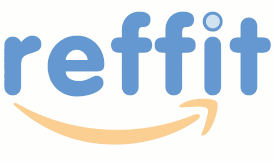

reffit: Referrals on Reddit 
===========================

Reffit is a natural language recommendation bot that applies predictive analysis on the social networking website Reddit to determine users who are actively inquiring for product suggestions, then builds a persuasive recommendation of a relevant and highly-rated Amazon product by intelligently synthesizing the product's price, description, and reviews.

Detecting User Inquiry
----------------------
The clearest indication of a user's readiness to purchase can be found in the subreddit (an organized categorical area of interest within Reddit) that a user's comment is written in. Examples of subreddits with high purchasing activity include [BuyItForLife](https://reddit.com/r/BuyItForLife), where users ask for suggestions of products that last a lifetime, [Frugal](https://reddit.com/r/Frugal), where users recommend low-cost alternatives to everyday purchases, and [MaleFashionAdvice](https://reddit.com/r/MaleFashionAdvice) (and its female counterpart [FemaleFashionAdvice](https://reddit.com/r/FemaleFashionAdvice)), where users are inspired to purchase the fashionable clothing of tomorrow.

Also indicative of a user's purchasing tendency is the text of his or her comment in relation to the comments within the subreddit. Comments with a comparatively high proportion of words such as "buying", "price", or "advice" correlate highly with a user's likeliness to consider a product recommendation.

Furthermore, users who mention the plural form of multiword product category keywords, such as "arm warmers", "laptop sleeves", or "hand sanitizers", are likely to be seeking a suggestions for a particular item within such category.

A comment's subreddit, proportion of suggestive keywords, and mentions of general products can together give us a coherent presumption towards the user's tendency to purchase.

Generating a Credible Response
------------------------------
A personalized and enthusiastic suggestion is more persuasive than any combination of price, rating, or even relevance. But how can this be automated while still maintaining a level of compassion and recognition?

The first step is not to suggest to a user, but to reply to one. By responding to a user's comment directly, we will have already established a sense of shared reciprocity with the user before he or she even begins to read our suggestion.

The suggestion itself must sound like a suggestion that a user would hear from his or her peers. This bot achieves this by implementing randomized sentence templates customized to a user's past comment history. (While this method may not exactly pass the Turing test, genuine, human-like responses may soon be possible with natural language processing and neural networks.)

Finally, the recommended product must be highly relevant to what the user is looking for. The bot determines nouns in a user's comment which correlate to a specific Amazon product category, then returns a relevant, highly-rated product in such category with such keywords. The product's brand, price, decription, reviews, and specifications are then seamlessly woven into a natural language recommendation.

Technical Implementation
------------------------
Reffit is coded in Python with the Reddit API and Amazon API, using OAuth for authenticating Reddit accounts and Amazon Affiliate tracking, BeautifulSoup for scraping the Amazon website, Pandas and Numpy for data analysis, and SQL for storing and retrieving natural language sentence templates.

Broadly, Reffit works in three steps.

1. For all recent comments from within a set of subreddits with high purchasing activity, calculate a reply confidence for each comment by parsing for relevant keywords.
2. If a comment exceeds the confidence threshold, search Amazon for a relevant product to the user's comment.
3. Using data from this product, generate a convincing, human-like recommendation for the product, then return to step 1 to scrape new comments.

### 1. Searching
How many of the words in the comment are equivalent to keywords which hint that a user is looking to buy?

|[Suggestives (partial list)](reffit/data.csv)|
|-----------------|
| recommended     |
| recommending    |
| recommend       |
| recommendation  |
| recommendations |
| recommends      |
| favored         |
| favoring        |
| favor           |
| favors          |
| suggested       |
| suggesting      |
| suggest         |
| suggestion      |
| suggestions     |
| suggests        |
| vouched         |
| vouching        |
| vouch           |
| vouches         |
| advised         |
| advising        |
| advise          |
| advice          |
| advises         |
| advices         |
| plug            |
| swear           |
| praise          |
| depend          |
| product         |
| products        |
| item            |

### 2. Matching
Does the user mention a brand or product category, and if so, which Amazon product is most relevant to what the user is envisioning?

|[Categories (partial list)](reffit/data.csv)|
|-----------------------------------|
| Cold Weather Accessories          |
| Arm Warmers                       |
| Ear Muffs                         |
| Fingerless Gloves                 |
| Hand Muffs                        |
| Neck Warmers                      |
| Diaper Bags                       |
| Prescription Eyewear              |
| Day Clutches                      |
| Evening Bags                      |
| Baseball Caps                     |
| Cowboy Hats                       |
| Derby Hats                        |
| Knit Caps                         |
| Newsboy Caps                      |
| Straw Hats                        |
| Sun Hats                          |
| Laptop Bags                       |
| Checkpoint-friendly Laptop Cases  |
| Hard Drive Cases                  |
| Laptop Backpacks                  |
| Laptop Messenger Bags             |
| Laptop Sleeves                    |
| Netbook Cases                     |
| Projector Cases                   |
| Wheeled Laptop Cases              |
| Women's Laptop Bags               |
| Luggage, Bags                     |
| Duffle Bags                       |
| Gym Bags                          |
| Messenger Bags                    |
| Garment Bags                      |
| Hardside Luggage                  |
| Matching Sets                     |
| Rolling Luggage                   |
| Travel Accessories                |
| Luggage Tags                      |
| Packing Cubes                     |
| Packing Folders                   |
| Shoe Bags                         |
| Sports Fan Accessories            |
| Tote Bags                         |
| Hard Hats                         |
| Neck Ties                         |
| Bow Ties                          |
| Wallets, Money                    |
| Key Organizers                    |
| Card Cases                        |
| Money Clips                       |
| Checkbook Covers                  |

### 3. Recommending
How can we construct and integrate 3-4 sentences to highlight the product's attributes while maintaining a down-to-earth tone?

| brand                                                                  | category                                                                  | price                                                   | link                                                                    |
|------------------------------------------------------------------------|---------------------------------------------------------------------------|---------------------------------------------------------|-------------------------------------------------------------------------|
| {} is one of the better brands for these.                              | This is probably the one of the better {}.                                | For less than {}, you can't go wrong.                   | I prefer {}.                                                            |
| {} makes nice stuff.                                                   | I prefer this when it comes to {}.                                        | It's a not a bad deal for less than {}.                 | I opted for {}.                                                         |
| You can't go wrong with {}.                                            | I've wanted a nice {} for quite some time.                                | Even if {} seems a bit pricy, it's well worth the cost. | I've always loved {}.                                                   |
| I've been using {} for a while, and its products have never failed me. | It's hard to find good {}.                                                | Honestly, it's less than {}.                            | I use {}, but I'm not sure how it compares to others.                   |
| {} is pretty decent for stuff like this.                               | You have many other options though.                                       | And it's less than {}.                                  | {} is not too shabby.                                                   |
| Have you heard of {}?                                                  | I've used {} for a while.                                                 | You can't go wrong for less than {}.                    | {} is a possibility.                                                    |
| I've been a customer of {} for quite some time.                        | There aren't that many good {} out there.                                 | Less than {} too.                                       | I haven't been disappointed by {}.                                      |
| {} is actually not that bad.                                           | It's hard to find some quality {}.                                        | Best part: it's less than {}.                           | Of the ones I've tried, {} stands out.                                  |
| I am personally partial towards {}'s stuff.                            | I find it incredibly difficult to find decent {}.                         | Tell me, can you get anything better for less than {}?  | I like {}.                                                              |
| I like the way {} makes these.                                         | When it comes to {}, there aren't that many good products to choose from. | In my opinion, the price is fair for what you get.      | You should check out {}.                                                |
| {} makes some decent products.                                         | I've tried to find good {} for years.                                     | Not bad for the price.                                  | Not sure if this is what you're looking for, but {} works great for me. |
| I like to try different brands from time to time.                      | I'm very picky when it comes to {}.                                       | It's almost {}, so there's that. . .                    | I'm suprised no one has mentioned {}.                                   |
| You should check out {}'s stuff.                                       | But this isn't for everyone.                                              | The price (~{}) is not too bad. . .                     | {} stands out to me.                                                    |
| Try {}'s stuff.                                                        | You have limited options for {}.                                          | And the price: less than {}.                            | Try {}.                                                                 |
| I don't know if you've heard of {} before.                             | If you're looking for {}, trust me on this.                               | Try to find something better for {}.                    | Heard of {}?                                                            |
| Why not try {}?                                                        | There are huge differences in quality between crappy {} and quality ones. | Hey, it's less than {}.                                 | You've heard of {} before?                                              |
| {}'s stuff is durable af.                                              | It's worth it to splurge on {}.                                           | You can get it for less than {} on Amazon.              | I personally love {}.                                                   |
| {}'s products are actually alright.                                    | I sort of collect {}.                                                     | Amazon sells it for pretty cheap at less than {}.       | I've suggested {} to everyone in my family.                             |
| Try checking {}'s stuff out.                                           | Please do your research before buying {}.                                 | Amazon has it for less than {}.                         | Amazon sells {} with two-day shipping.                                  |
| {} has been a reliable, go to, brand for me.                           | I've tried many brands for {}.                                            | At {}, the price is on par with the quality.            | I'm partial towards {}.                                                 |
| Check out {}.                                                          | You have a lot of good options on Amazon if you're looking for {}.        | You get what you pay for. . .                           | I've used {}.                                                           |
| I've only heard of {}.                                                 | I know you have a lot of options to choose from.                          | Don't worry about the price on this one.                | {} could work too.                                                      |
| {} is a quality manufacturer.                                          | There are a lot of good options out there.                                | They're not trying to rip you off.                      | Amazon has {}.                                                          |
| {} sells their stuff on Amazon.                                        | But honestly, any generic brand will be fine.                             | Your money will be well spent.                          | Try buying {} from Amazon.                                              |
| Maybe try {}?                                                          | Don't worry about finding the perfect {}.                                 | This isn't too expensive.                               | I only know of {}.                                                      |
| {} is ok.                                                              | It's hard to find something really good.                                  | This isn't not too cheap though.                        | I use {}, but I don't know how it compares to others.                   |
| {} is alright.                                                         | Sometimes I wish there were more options though.                          | I think you can afford the {}.                          | Well, there's {}.                                                       |
| Beware of {} imitations.                                               | There are a lot of crappy products out there.                             | Does the price matter to you?                           | Not sure if {} is what you're looking for.                              |
| {} has a lot of products to choose from.                               | Consider where it's made.                                                 | How important is the price to you?                      | Maybe you're looking for something like {}?                             |
| Remember to look at which brand it is.                                 | Keep in mind the warranty too.                                            | Don't cheap out when buying these.                      | Could {} work?                                                          |
| I advise you to keep in mind the brand.                                | The shipping policy is nice.                                              | Keep the price in mind.                                 | Maybe {} is what you're looking for.                                    |
| There's a big difference between brands.                               | The refund policy is great.                                               | Don't buy anything too expensive.                       | If it's of any relevance, I use {}.                                     |
| The brand really makes it or breaks it.                                | This has some pretty good reviews on Amazon.                              | Don't buy anything too cheap.                           | Could you possibly try {}?                                              |
| I've used {} products before.                                          | The Amazon ratings tell you the rest.                                     | Avoid anything that's too expensive.                    | {} might be what you're looking for.                                    |
| The other stuff from {} is kind of crappy though.                      | Correct me if I'm wrong, but it might be on sale right now.               | Avoid anything that's too cheap.                        | I don't know if it's relevant, but maybe {}?                            |
| You need to check out {}.                                              | Not sure if {} are what you're looking for.                               | Only {} too.                                            | My friend uses {}.                                                      |
| It's a {} product.                                                     | Free shipping is nice too.                                                | Sorry if it's a bit on the expensive side.              | Maybe {} could work?                                                    |
| I use {} stuff every day.                                              | What more could you ask for?                                              | {} isn't that bad.                                      | Check out {}.                                                           |
| Can't go wrong with {}.                                                | It's not the best, but it works.                                          | {}, so you won't go broke.                              | Maybe check out {}.                                                     |
| Not a bad brand either.                                                | This is great for most situations.                                        | The {} you pay is totally worth it.                     | I use {}.                                                               |
